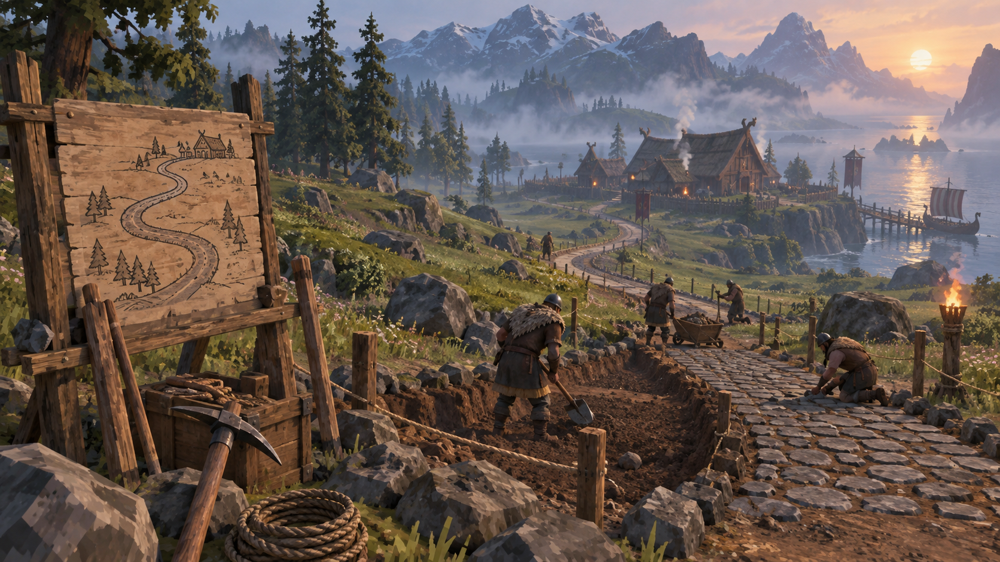
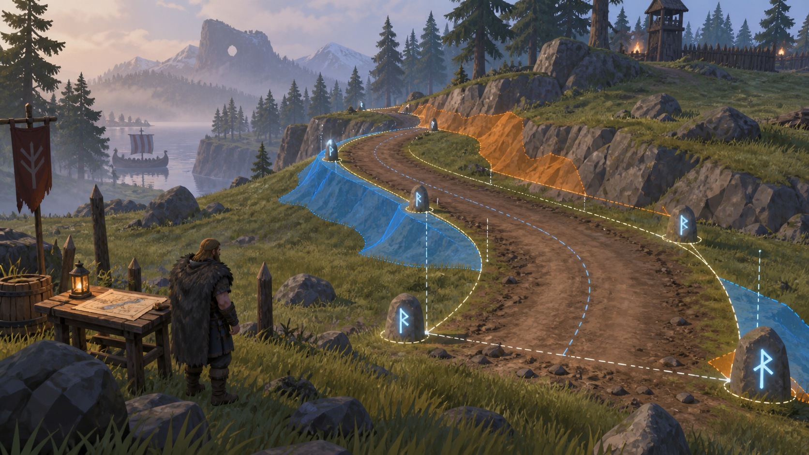

# EarthWorks

[English (primary)](README.md)



*Концепт-арт направления EarthWorks, не игровой screenshot.*

EarthWorks — мод для Valheim, который превращает строительство дорог из серии ручных ударов киркой и мотыгой в управляемый проект. Игрок задаёт маршрут, форму полотна, высоту, ширину и покрытие, проверяет точный preview на реальной Heightmap-сетке Valheim, а затем выполняет работу по этапам через постоянную проектную доску.

Текущая версия — **0.6.4**. Она собрана и статически проверена для Valheim **1.0.12**, Steam build **25253764**, network version **40**, Unity **6000.0.75f1**, BepInExPack Valheim **5.4.2350** и Jotunn **2.30.0** с нашим исправлением регистрации terrain-операций.

> EarthWorks 0.6.4 — проверенная статически и автоматическими тестами development-сборка. Valheim при подготовке не запускался; полный runtime acceptance ещё не завершён.

## Что уже работает

### Маршрут дороги

- Две и более контрольные точки.
- Прямые сегменты, X-Spline, B-Spline, ручные Bezier-кривые и резкие Corner-точки.
- Принудительно прямой сегмент между выбранными точками.
- Вставка точки на существующей кривой и удаление выбранной точки.
- Сохранение незавершённого черновика при временном переключении инструмента.

### Единый редактор



*Визуальная идея редактора; финальный интерфейс определяется реальной сборкой мода.*

- Отдельный режим по `F7` с камерами Plan и Isometric.
- Перемещение, вращение, масштабирование и автоматическое кадрирование маршрута.
- Перетаскивание контрольных точек прямо над игровым рельефом.
- Ручная и автоматическая высота каждой точки.
- Независимая ширина полотна слева и справа.
- Ручные Bezier-ручки и настройка сглаживания X-Spline.

### Геометрия и рельеф

- Четыре продольных профиля: линейный, линейный с мягкими стыками, мягкие окончания и полный S-профиль.
- Точная фиксация конечных отметок и проверка допустимого уклона.
- Опциональная подгонка начала и конца к плоскости исходного рельефа.
- Расчёт среза, насыпи, плеч и всех затронутых вершин Heightmap.
- Плоское поперечное полотно без случайного центрального гребня.

### Покрытие и preview

- Чистая земля и мощение.
- Общее покрытие маршрута и переопределение отдельных сегментов.
- Режимы Current, Result и Difference.
- Цветовая проверка изменений: насыпь, срез, неизменённые точки и ошибки.
- Preview использует тот же рассчитанный terrain-план, который затем применяется к миру.
- Черновик не изменяет мир до подтверждения проекта.

### Проектная доска и выполнение

- Автоматическое создание постоянной доски рядом с началом маршрута.
- Сетевое сохранение данных и текущей стадии проекта.
- Шесть стадий: подготовка, разметка, расчистка, земляные работы, покрытие и завершение.
- Применение высот и paint через штатные `TerrainComp` и `Heightmap` Valheim.
- Очистка временной разметки после завершения.
- Английская и русская локализация: 227/227 токенов, автоматическая проверка ключей, параметров, динамических состояний и отсутствия смешанного языка.
- JSON-переводы встроены в DLL и при необходимости переопределяются файлами `Translations/EarthWorks/<Language>/translations.json`.

## Ограничения текущей версии

- Это ещё не финальный survival-релиз Road Project 0.1.
- Экономика материалов, инструментов, выносливости и времени пока не завершена.
- Не подтверждены полный reload/restart, второй клиент и длительная multiplayer-сессия.
- Перекрёстки, дорожная сеть, площадки, котлованы и Terrain Edit находятся в следующих этапах.
- Точная paint-grid parity, сохранение alpha специальных mask-данных, seams/углы chunks и очистка травы только внутри коридора теперь являются обязательным pre-release gate.
- Мод должен быть установлен на сервере и у каждого участвующего клиента.

## Установка

1. Установить BepInExPack Valheim 5.4.2350 и Jotunn 2.30.0.
2. Скачать `EarthWorks-0.6.4.zip` из GitHub Releases.
3. Распаковать `EarthWorks.dll` и `EarthWorks.Geometry.dll` в одну папку внутри `BepInEx/plugins`.

## Сборка и тесты

EarthWorks ссылается на локальные игровые DLL и не распространяет их в репозитории:

```powershell
dotnet build .\src\EarthWorks\EarthWorks.csproj -c Release `
  -p:ProfileRoot="C:\path\to\ValheimProfile\" `
  -p:ValheimManagedDir="C:\path\to\Valheim\valheim_Data\Managed"

dotnet run --project .\tests\EarthWorks.GeometryTests\EarthWorks.GeometryTests.csproj -c Release
```

Для версии 0.6.4 проходят **24/24** geometry-теста и **5/5** persistence/localization-тестов; API-аудит подтверждает актуальные интерфейсы, Harmony targets и reflection-контракты Valheim 1.0.12.

## Документация

- [Полная дорожная карта](ROADMAP_RU.md)
- [Контракт продукта и границы Road Project 0.1](PROJECT_CONTRACT.md)
- [Сценарий runtime-проверки](TESTING.md)
- [История версий](CHANGELOG.md)
- [Подробности релиза 0.6.4](docs/RELEASE_0.6.4_RU.md)
- [Как предложить изменение](CONTRIBUTING.md)
- [Архитектура и карта исходников](docs/ARCHITECTURE_RU.md)
- [Совместимость terrain и план проверки инструментов](docs/TERRAIN_COMPATIBILITY_AND_TEST_PLAN_RU.md)

## License

EarthWorks распространяется по [proprietary source-available лицензии](LICENSE.md), а не как open-source проект.

- Официальные неизменённые бинарные релизы можно использовать для личной некоммерческой игры.
- Исходный код можно просматривать и форкать для подготовки Pull Request.
- Использование кода в других проектах, публикация изменённых сборок и коммерческое использование требуют предварительного письменного разрешения Ostrix.
