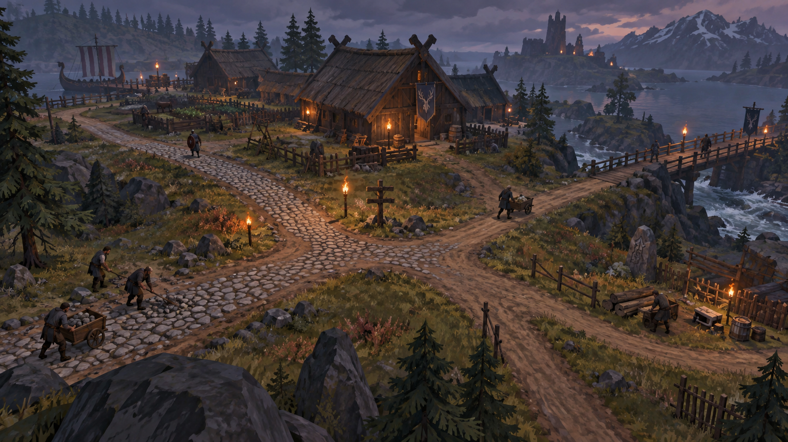
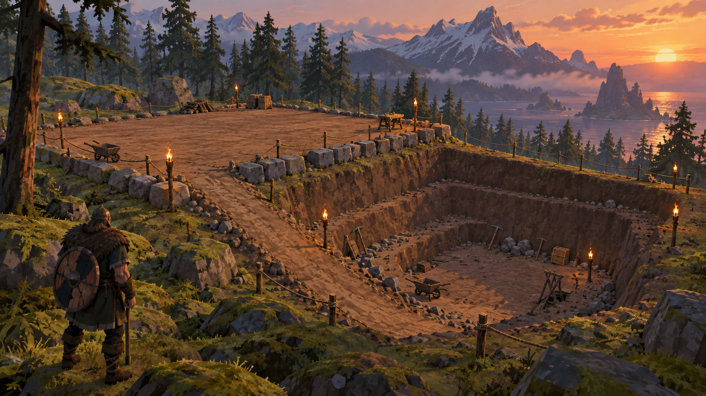

# EarthWorks roadmap

[Русская версия](ROADMAP_RU.md)

**Document status:** September 13, 2026
**Current development build:** Road Project 0.1 editor, version 0.6.3

EarthWorks aims to remove repetitive terrain clicks while preserving Valheim survival rules. Players still gather materials, use tools, spend stamina and time, respect wards and server limits, and remain vulnerable while work is performed.

## Available now

- Multi-point routes with straight, X-Spline, B-Spline, Bezier, and Corner geometry.
- Plan/Isometric editor with direct point manipulation, exact and automatic elevations, independent side widths, four longitudinal profiles, endpoint terrain fitting, and exact terrain-grid previews.
- Bare and paved surface selection per route or segment.
- Persistent networked project board with six execution stages.
- English/Russian localization with automated 252-token parity checks.
- Guarded development deployment and 24 geometry regression checks.

## Phase 1 — Proven Road Project 0.1

- Complete the controlled runtime protocol on Valheim 1.0.12/Jotunn 2.30.0.
- Prove preview-to-applied-terrain parity.
- Verify all six stages, world reload, server restart, reconnect, second client, and ordinary survival restrictions.
- Fix only failures demonstrated by those tests and record safe route/vertex limits.

**Exit:** one reproducible end-to-end persistent road scenario.

## Phase 2 — Survival and multiplayer authority

- Real material, tool, station, stamina, durability, and time costs.
- Stop work on damage, threats, lost access, or player interruption.
- Server-authoritative permissions, wards, protected zones, and concurrent-worker safety.
- Recoverable cancellation and aging of abandoned projects.

**Exit:** road building behaves as survival construction, not a world editor.

## Phase 3 — Road networks

*Direction concept; not a current gameplay screenshot.*

- Lightweight records for completed roads.
- Detect compatible intersections with existing EarthWorks routes.
- Editable T, X, and Y junctions, surface blending, and merge-radius control.
- Optional route assistance around exclusion zones while respecting grade limits.
- Sectioned construction and supply camps for long routes.

## Phase 4 — Platforms and foundations

*Direction concept; not a current gameplay screenshot.*

- Closed useful-area contour with automatic or exact elevation.
- Exterior slopes that do not consume the requested platform area.
- Holes that preserve original terrain.
- The same persistent, server-authoritative project lifecycle.

## Phase 5 — Excavations

- Linked top and bottom contours.
- Absolute floor elevation, relative depth, or object-relative reference.
- Global wall slope with per-side overrides.
- Top-down staged excavation, water warning, and explicit ramp placement.

## Phase 6 — Local Terrain Edit

- Raise, lower, smooth, level, slope, paint, and restore original terrain.
- Circle, square/grid-aligned, and line brushes.
- Exact and relative grid heights, pinned vertices, planes, and proportional editing.
- Draft-only undo/redo and server-side overlap locking.

The active [TerrainTools compatibility branch](https://github.com/MaikiOS/TerrainTools/tree/fix/valheim-1.0-compat) informed this direction: grid-aligned operations, exact elevation, original-terrain reset, live radius/sharpness preview, and explicit compatibility checks are useful product ideas. TerrainTools is GPL-3.0; EarthWorks will not copy its implementation into this proprietary codebase. Any adopted behavior must be independently designed and implemented.

## Phase 7 — Balance, compatibility, and public release

- Tune costs, work time, stamina, grades, shoulders, threat distance, and performance limits.
- Verify long routes, camera-mod coexistence, and approved terrain-range extensions.
- Finalize board, stakes, flags, supply storage, effects, migration, and server/client instructions.
- Publish a clean package without laboratory-only components after runtime acceptance.

## Deferred

- NPC workers and offline construction.
- Bridges, tunnels, multilevel junctions, retaining walls, terrain stamps, and road crowns.
- Caves, overhangs, and vertical terrain walls, which Valheim's heightmap cannot represent.
